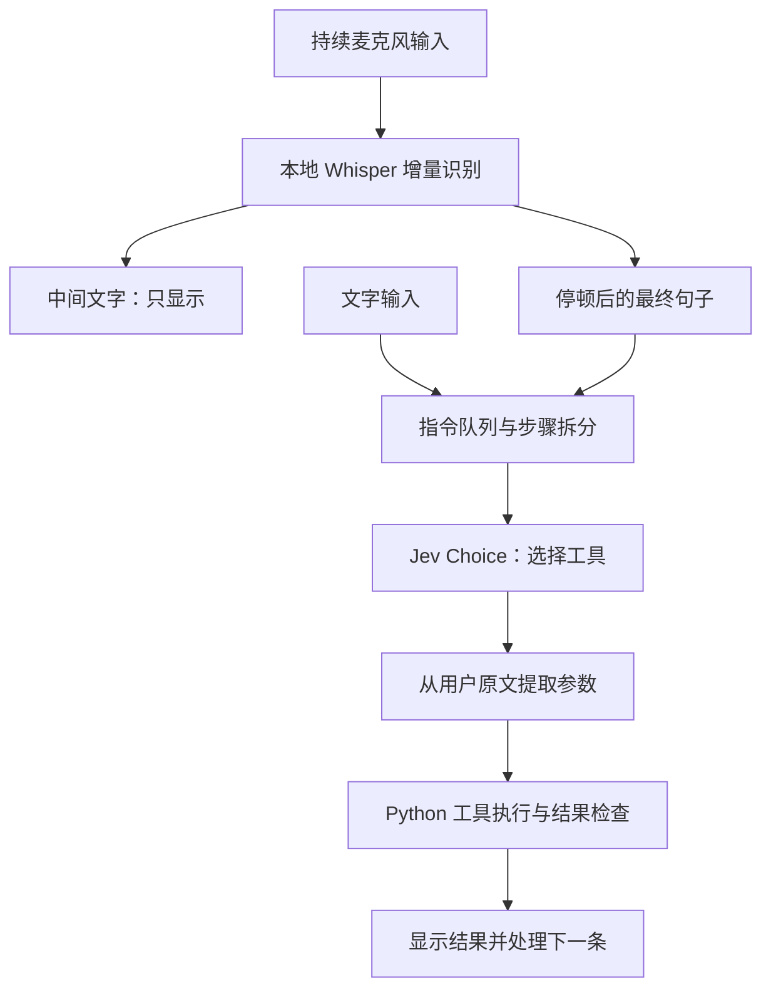

# Jev Desktop Agent · Windows 语音桌面助手

用语音或文字操作 Windows 的 Python Agent demo。语音在本地转换为文字，**TypeSafe Jev 负责选择工具**，Python 执行记事本、浏览器、文件和系统相机操作。

这是一个功能范围明确的实验项目：目前使用本地 Whisper 分块识别，语音准确率和响应速度仍待改善。云端流式识别、自然打断和语音播报尚未实现。

## 能做什么

- **持续语音输入**：点击一次“开始对话”，边说边显示中间识别结果，停顿后自动发送最终句子。
- **文字输入**：直接输入指令，点击“发送文字”或按 Ctrl+Enter。
- **记事本**：新建、输入、导出文本内容、关闭助手打开的文档。
- **浏览器**：打开网页、搜索关键词、关闭助手浏览器；Chromium 启动失败时尝试 Edge、Chrome。
- **文件**：在配置的工作目录内创建、读取、覆盖和追加文本文件。
- **Windows 相机**：说“打开相机”显示预览，再说“拍照”触发快门。
- **执行控制**：预览工具选择、按顺序处理指令、停止待执行动作。

## 工作原理



Jev 调用采用 `state + questions + criteria` 的官方决策接口，而非聊天补全接口。它返回工具选项、概率与置信度。正文、搜索词和文件名由本地规则从用户原文提取；当前没有额外的生成式 LLM 替用户编写这些参数。

语音识别和工具执行使用不同后台线程，因此执行一条指令时仍可识别下一句。工具操作串行执行；**新开口不会自动打断正在执行的任务**，需要点击“停止全部”。

## 快速开始

需要 Windows 10/11、Python 3.11–3.13（建议通过 uv 使用 3.13）、[uv](https://docs.astral.sh/uv/getting-started/installation/) 和 [TypeSafe API key](https://console.typesafe.ai/)。麦克风和摄像头按所用功能选配；相机功能需要安装 Windows 相机应用。

在本目录打开 PowerShell，安装依赖：

```powershell
uv sync --python 3.13
uv run playwright install chromium
Copy-Item .env.example .env
```

已有 `.env` 时跳过复制，避免覆盖配置。也可以运行 `./setup.ps1`，该脚本会保留已有 `.env`。
没有 uv 时先按 [uv 官方安装说明](https://docs.astral.sh/uv/getting-started/installation/) 安装。

编辑 `.env`：

```dotenv
TYPESAFE_API_KEY=你的_TypeSafe_API_Key
JEV_MODEL=jev-latest
```

启动：

```powershell
uv run python main.py
```

点击一次“开始对话”，等待状态显示“正在监听”，之后保持麦克风开启：

1. 说话时，输入框增量显示识别文字。
2. 停顿约 1 秒，最终识别结果自动发送给 Jev；无需点击执行。
3. 对话区显示你的指令和执行结果；执行过程中仍可说下一句，指令按顺序执行。
4. 点击“停止监听”关闭麦克风、丢弃尚未提交的识别结果以及待执行语音指令。已开始的任务继续完成。
5. 点击“停止全部”同时清空队列，并请求停止正在执行任务的后续动作。

停止监听后也能在输入框打字，点击“发送文字”或按 Ctrl+Enter。程序启动时默认不打开麦克风；开始对话后无需为每句话重复点击。

这是本地 Whisper 的**分块增量识别**，不是逐字零延迟的原生流式模型：默认每约 1 秒生成一个中间识别任务，中间文字可能被修正；实际显示速度和停顿后的延迟取决于 CPU 与模型大小。只有最终句子送给 Jev，中间文字绝不执行。当前无语音播报，结果以文字显示。

勾选“仅预览”会真实调用 Jev 并显示工具和参数，但不会操作电脑。预览仍会产生 TypeSafe API 费用。

## Jev 接口与环境变量

依据 [TypeSafe 官方 Quick start](https://docs.typesafe.ai/introduction/quickstart) 和 [Choice 文档](https://docs.typesafe.ai/primitives/choice)，使用官方 REST API：

```text
POST https://api.typesafe.ai/v1/systemone
Authorization: Bearer <TYPESAFE_API_KEY>

请求：state + model + questions
选择题：type="choice" + instructions + criteria
读取：answers.action.choice / confidence / probabilities
```

本项目直接使用 Python 标准库调用上述接口，不依赖 OpenAI SDK。`TYPESAFE_API_KEY` 是官方凭据变量；`JEV_MODEL`、`JEV_TIMEOUT_SECONDS`、`JEV_MIN_CONFIDENCE` 是本 demo 自己读取的配置项，不声称它们是官方 SDK 环境变量。系统已有的同名环境变量优先于 `.env`。

语音识别使用本机 faster-whisper，默认 CPU/int8 和 `small` 多语言模型。首次使用需要下载模型，之后本地转写，不需要语音服务 API key。网络访问 Hugging Face 不畅时可把 `WHISPER_MODEL` 改为已下载的兼容模型目录。`MIC_DEVICE` 留空使用默认麦克风。相机使用 Windows 相机应用；多个摄像头请在相机窗口中切换，旧的 `CAMERA_INDEX` 配置不再使用。

录音只在内存中暂存，不写入磁盘；转写文字发送到 Jev。文件读取内容仅在本地界面显示，不作为模型上下文发送。界面执行记录不自动写磁盘。照片由 Windows 相机保存，默认在系统“图片 / 本机照片（Camera Roll）”文件夹。助手通过 Windows Known Folder API 查找实际目录；如果在系统中更改了照片保存位置，可在 `.env` 设置 `CAMERA_ROLL_DIR` 为该目录。

可在现有 `.env` 末尾添加以下配置，无需重新复制或更换密钥：

```dotenv
SPEECH_SILENCE_SECONDS=1.0
SPEECH_RMS_THRESHOLD=0.012
SPEECH_PARTIAL_INTERVAL=1.0
```

说话尚未结束就提交时，增大 `SPEECH_SILENCE_SECONDS`（例如 `1.5`）；说话没有反应可降低 `SPEECH_RMS_THRESHOLD`（例如 `0.006`）；环境噪音频繁触发时适当提高阈值。识别较慢时可将 `WHISPER_MODEL` 改成 `base`，以识别精度换取速度，首次切换会下载对应模型。修改后重启助手。

为防止累积过期操作，最多排队三条待执行指令；队列满时会提示本句没有发送。连续讲话超过 20 秒的整句会丢弃，不执行截断的命令，请停顿后分句说。停止监听后到达的旧识别结果也会丢弃。

## 支持的口令

为了避免用额外 LLM 生成文字，参数采用明确句式。**正文、文件名、搜索词来自用户原文；Jev 只选择操作。**

| 功能 | 示例 |
| --- | --- |
| 新建记事本 | 打开记事本 |
| 记事本追加文字 | 写入：“明天下午三点开会” |
| 保存编辑区内容 | 保存为：会议.txt |
| 关闭记事本文档 | 关闭记事本 |
| 浏览器 | 打开浏览器 |
| 指定网址 | 打开浏览器 https://example.com |
| 搜索 | 搜索：Python 教程 |
| 关闭助手浏览器 | 关闭浏览器 |
| 空文件 | 创建文件：笔记.txt |
| 写文件 | 写入文件：笔记.txt，内容：“你好” |
| 追加文件 | 追加文件：笔记.txt，内容：“第二段文字” |
| 读文件 | 读取文件：笔记.txt |
| 在记事本打开文件 | 打开文件：笔记.txt |
| 打开相机预览，不拍照 | 打开相机 |
| 在已经打开的相机中拍照 | 拍照 / 拍照片 / 拍一张 |

组合示例：

```text
打开记事本；然后写入：“明天下午三点开会”；然后保存为：会议.txt
打开浏览器；然后搜索：Python 教程
写入文件：笔记.txt，内容：“你好”；然后打开文件：笔记.txt
```

使用“然后”“接着”或分号分隔步骤，最多 10 步。连续语音建议一次说一个动作，例如“打开记事本”，停顿后再说“写入明天下午三点开会”。正文包含“然后”等分隔词时，建议停止监听后用文字输入，并为正文加双引号。当前不支持“帮我写一篇文章”、任意 GUI 点击或开放式复杂规划。含糊或缺参数的命令会停止并给出格式提示。

## 执行范围

- 所有文本文件位于 `WORKSPACE_DIR`（默认 `data/workspace`）内，使用相对文件名。可在 `.env` 中把工作目录改成自己指定的文件夹。
- 支持 UTF-8 的 `.txt/.md/.csv/.json/.log`；读取限制为 1 MB；路径越界会拒绝。
- 记事本使用唯一名字的草稿文件，通过 Windows UI Automation 定位编辑区；优先 ValuePattern，缺少该接口时聚焦编辑区并输入转义后的 Unicode 按键。执行过程中请不要手动切换窗口或输入；完成后会读取编辑区校验。无法识别编辑区时会报错停止。
- “保存为”是读取编辑区并导出文件，**不更改原记事本标签名或原生未保存标记**。关闭时可能仍出现 Windows 保存对话框，需要手动处理。
- 浏览器优先使用 Playwright 独立的可见 Chromium；启动失败时自动尝试本机 Edge、Chrome，仍使用独立临时资料，不共用个人浏览器资料。执行记录会显示实际启动的浏览器。关闭浏览器只影响助手启动的实例。没有网页自由导航 Agent；搜索会直接构造 Bing 搜索地址。
- “打开相机”启动 Windows 相机并保持预览，不按快门。看到画面后再说“拍照”；助手识别相机的照片模式按钮，必要时从视频切换到照片模式，然后只按一次照片快门。拍完保留窗口，并检查系统相册是否出现新照片。找不到控件时报告实际按钮名称；无法确认新照片时不会自动重拍。
- 覆盖现有文件、关闭窗口、低置信度动作会在本地弹窗确认。
- 停止按钮阻止后续动作；不能撤销已发生操作，也不能强行中止正在进行的网络调用、语音推理或设备驱动调用。
- Jev API 错误、非法返回、参数错误和工具失败均停止本次任务，不自动重试操作。

## 目录与扩展

```text
main.py                         启动 GUI
desktop_agent/
  config.py                     .env 配置
  gui.py                        对话界面、自动发送、命令队列、确认弹窗
  continuous.py                 持续采音、停顿断句、中间结果合并、后台识别
  voice.py                      本地 Whisper 模型与转写
  interpreter.py                多步骤切分、原文参数提取
  jev_client.py                 官方 Jev REST 接口
  agent.py                      逐步观察、Jev 选择、执行、停止
  tools/
    registry.py                 工具选项与分发
    notepad.py                  记事本 UIA 操作
    browser.py                  独立浏览器
    files.py                    有范围的文本文件读写
    camera.py                   Windows 相机预览、照片模式、快门与相册验证
tests/                          接口契约和停止/文件逻辑测试
.env.example                    配置模板
uv.lock                         已解析的依赖版本
```

添加工具时：在 `registry.py` 添加描述和执行分支，在 `interpreter.py` 添加参数提取，再增加相应实现。不要把 Jev 输出直接当 shell 命令或 Python 代码执行。

## 测试

```powershell
uv run pytest -q
uv run ruff check .
```

自动测试使用模拟的 Jev HTTP 响应，验证协议字段、异常返回、取消、低置信度、文件范围和覆写处理；语音测试使用合成音频块与模拟识别结果，覆盖停顿断句、静音、过长讲话、自动发送、重复/过时结果、后台排队和停止。不消耗 API 额度。真实 Jev 调用需要自己的有效密钥；真实麦克风识别质量与速度、摄像头和实际记事本行为仍需在目标电脑按示例验收。

如果浏览器提示找不到 executable，运行 `uv run playwright install chromium`。如果录音失败，在 Windows 隐私设置中允许桌面应用访问麦克风；也可以先使用文字输入。摄像头被其他应用占用时，先退出占用应用。

## 当前验证与限制

- 44 项本地自动测试已通过，包括 Jev 请求契约、指令停止、语音分段、队列、窗口布局、浏览器回退和相机控件匹配。测试中的模型响应、音频识别结果及拍照调用使用模拟数据，不代表端到端成功率。
- 本机已验证可见 Edge 窗口打开网页，以及系统相机预览窗口和“切换到 照片 模式”控件的识别；自动快门与实际照片落盘尚未完成端到端验收。
- 当前 UI 自动化针对中文／英文 Windows 应用。应用版本、权限提示和窗口焦点变化可能影响执行。
- 本地语音存在误识别和延迟，特别是噪声、中英混合或较长句子。增量刷新间隔不等于识别延迟保证。
- 默认连续讲话超过 20 秒会丢弃该句；最多等待三条指令。适合短指令，不适合长篇口述。
- “停止全部”不会撤销已完成操作，也不能即时终止一个已经进入执行阶段的鼠标、网络或设备调用。

## 后续方向

- [ ] 接入真正的云端流式语音识别。
- [ ] 增加开口打断、语音“停止／取消”和更自然的说话结束判断。
- [ ] 改善中文口语参数提取与多轮上下文。
- [ ] 增加可选语音反馈和端到端设备测试。

`.env`、录音／照片等 `data/` 内容、虚拟环境和缓存均排除在 Git 版本管理之外。提交时只保留空密钥的 `.env.example`。
